# Rapport de Travaux Pratiques — DevOps

## Intégration et Déploiement Continus

**Jenkins · Maven · Git · SonarQube · Tomcat · Docker**

**Thierry NKENFACK TSANGUE** — IF2I, 1ère année
Travaux pratiques réalisés du 9 au 11 juillet 2026

---

## Sommaire

1. [Introduction](#introduction)
2. [TP 1 — Premier build avec Jenkins](#tp-1--premier-build-avec-jenkins)
3. [TP 2 — Build Maven : artefacts et tests](#tp-2--build-maven--artefacts-et-tests)
4. [TP 3 — Intégration continue : build automatique après chaque commit](#tp-3--intégration-continue--build-automatique-après-chaque-commit)
5. [TP 4 — Analyse de la qualité du code avec SonarQube](#tp-4--analyse-de-la-qualité-du-code-avec-sonarqube)
6. [TP 5 — Build paramétré](#tp-5--build-paramétré)
7. [TP 6 — Déploiement automatique sur Tomcat](#tp-6--déploiement-automatique-sur-tomcat)
8. [TP 7 — Pipeline Jenkins (pipeline as code)](#tp-7--pipeline-jenkins-pipeline-as-code)
9. [TP 8 — Agents Jenkins distribués](#tp-8--agents-jenkins-distribués)
10. [TP 9 — Sauvegarde de Jenkins avec ThinBackup](#tp-9--sauvegarde-de-jenkins-avec-thinbackup)
11. [Conclusion](#conclusion)

---

## Introduction

Ce rapport présente l'ensemble des travaux pratiques réalisés dans le cadre du module DevOps. L'objectif de ces TP est de mettre en place, pas à pas, une chaîne complète d'intégration et de déploiement continus (CI/CD) autour d'un projet Java construit avec Maven, depuis le premier build automatisé jusqu'à la sauvegarde du serveur d'intégration.

L'ensemble de l'infrastructure repose sur des conteneurs Docker communiquant sur un réseau dédié (`devops-network`) :

- **Jenkins 2.555.3** (conteneur `jenkins/jenkins:lts`, port 8080) : serveur d'intégration continue ;
- **SonarQube Community v26.7** (port 9000) : analyse statique et qualité du code ;
- **Tomcat 9** (port 8081) : serveur d'application pour le déploiement des WAR ;
- **Agent Jenkins SSH « agent-linux »** : exécuteur de builds distribué ;
- **GitHub** (dépôts `greenops` et `HW-maven`) : gestion de versions et déclenchement des builds.

Le projet support est une application Java « hello-world » construite avec Maven (Java 11, JUnit 4, JaCoCo), enrichie au fil des TP d'un module d'authentification, d'un module de calcul du périmètre d'un cercle et d'une interface web JSP.

Chaque chapitre suit la même logique : objectif du TP, mise en œuvre, difficultés rencontrées et solutions apportées. Les captures d'écran illustrent aussi bien les succès que les échecs, ces derniers faisant partie intégrante de la démarche d'apprentissage.

---

## TP 1 — Premier build avec Jenkins

### Objectif

Découvrir Jenkins et créer un premier job de type « freestyle » relié à un dépôt GitHub, puis lancer un build manuellement et analyser sa sortie console.

### Mise en œuvre

Un job « greenops freestyle » a été créé et connecté au dépôt GitHub `greenops`. Le premier build (#1) a été lancé manuellement depuis l'interface : il apparaît dans l'historique avec un état stable (coche verte) et les liens permanents pointent vers ce premier build réussi.

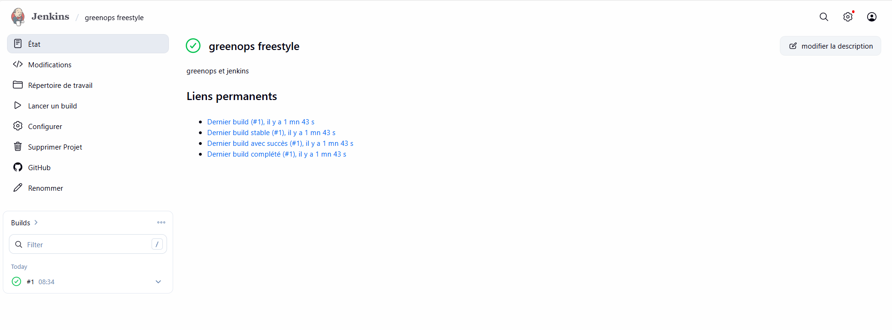
*Figure 1 — État du job « greenops freestyle » après le premier build réussi (#1).*

La sortie console détaille chaque étape exécutée par Jenkins : clonage du dépôt distant (`git init`, `git fetch`, `git checkout`), puis exécution du script shell configuré (`ls -l`) qui liste le contenu du projet cloné. Le build se termine par `Finished: SUCCESS`.

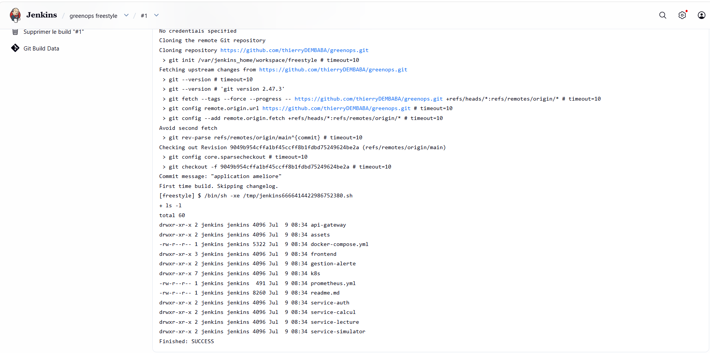
*Figure 2 — Sortie console du build #1 : clonage du dépôt GitHub puis exécution du script shell.*

### Bilan

Ce premier TP a permis de comprendre le cycle de vie d'un build Jenkins : récupération du code source, exécution d'étapes, restitution d'un état (SUCCESS/FAILURE) et conservation de l'historique.

---

## TP 2 — Build Maven : artefacts et tests

### Objectif

Créer un job de type Maven pour construire le projet `hello-world`, exécuter les tests unitaires et archiver les artefacts produits.

### Mise en œuvre

Le job « maven job » compile le module `com.example:hello-world`. À l'issue du build #1, Jenkins archive les artefacts générés : `hello-world-1.0-SNAPSHOT.jar` et son fichier `pom` associé. La page du build indique également « Résultats des tests (aucune erreur) ».

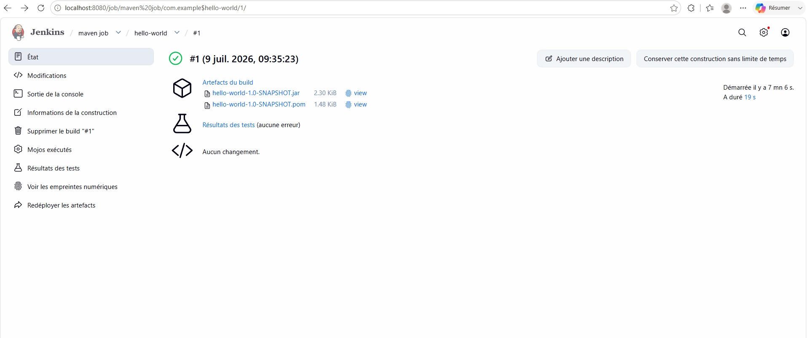
*Figure 3 — Build #1 du job Maven : artefacts archivés (jar et pom) et résultats de tests sans erreur.*

Le rapport de tests intégré à Jenkins confirme que le test unitaire du package `com.example` est passé (1 test, 0 échec, 0 sauté, exécuté en 8 ms).

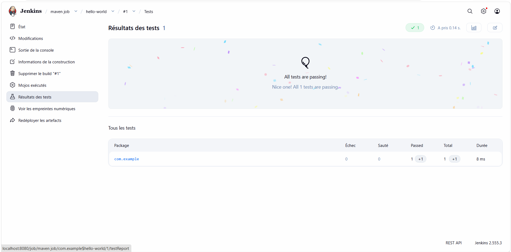
*Figure 4 — Rapport de tests Jenkins : « All tests are passing » (1/1).*

La console retrace le déroulement complet du build Maven : téléchargement des dépendances depuis Maven Central, construction du jar, installation dans le dépôt local (`.m2`), et enfin `BUILD SUCCESS` en 20,7 secondes.

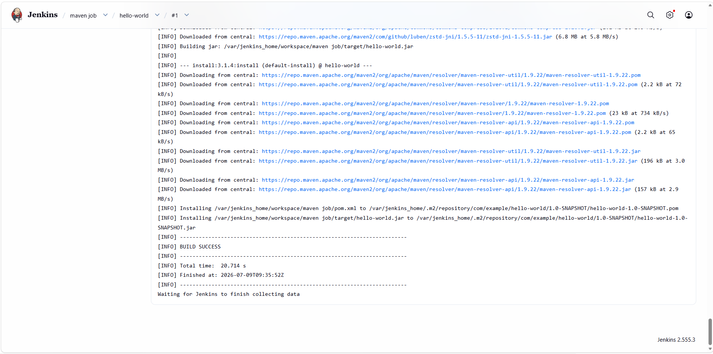
*Figure 5 — Sortie console : phase install de Maven et BUILD SUCCESS.*

### Bilan

Jenkins sait piloter nativement un build Maven : les tests JUnit sont détectés et publiés automatiquement, et les artefacts sont conservés au niveau du build, ce qui les rend téléchargeables et traçables.

---

## TP 3 — Intégration continue : build automatique après chaque commit

### Objectif

Mettre en place l'intégration continue : chaque `git push` vers le dépôt GitHub doit déclencher automatiquement un build du job « HW-ci », sans intervention manuelle.

### Mise en œuvre

Un commit de test (« test du build automatique #2 ») a été créé puis poussé vers le dépôt `HW-maven` depuis le terminal intégré de VS Code.

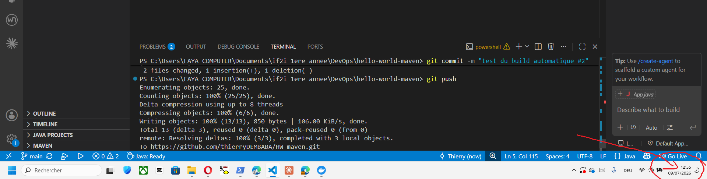
*Figure 6 — Commit et push vers GitHub depuis VS Code pour déclencher la chaîne CI.*

Quelques instants après le push, le job HW-ci (décrit « build apres chaque commits ») déclenche un nouveau build : l'historique montre les builds #1 et #2 réussis et un build #3 en attente, preuve que la scrutation du dépôt fonctionne.

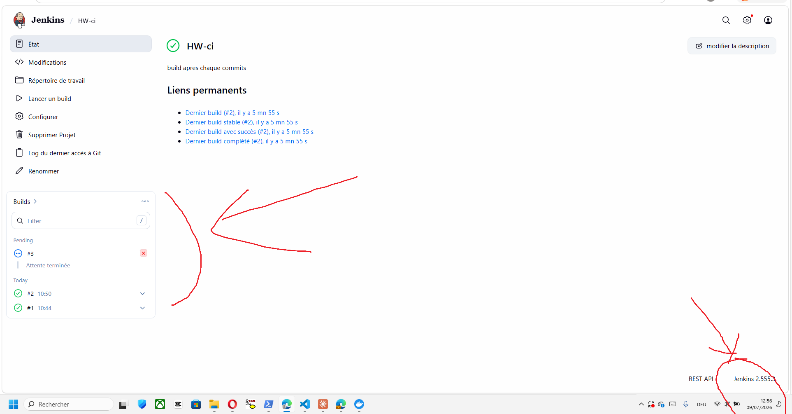
*Figure 7 — Job HW-ci : builds déclenchés automatiquement après les commits (build #3 en file d'attente).*

### Bilan

La boucle d'intégration continue est opérationnelle : le développeur pousse son code, Jenkins détecte le changement, construit le projet et exécute les tests. Tout commit cassant le build est ainsi détecté au plus tôt.

---

## TP 4 — Analyse de la qualité du code avec SonarQube

### Objectif

Intégrer SonarQube à la chaîne CI afin d'analyser automatiquement la qualité du code à chaque build : bugs, code smells, couverture de tests (via JaCoCo) et quality gate.

### Problème rencontré : serveur SonarQube injoignable

Le premier essai s'est soldé par un échec. Le build #4, déclenché par le commit « ajout JaCoCo pour couverture de code », échoue lors de l'étape d'analyse.

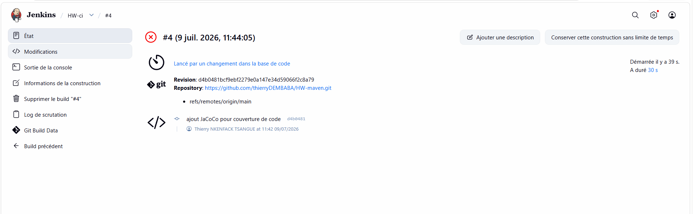
*Figure 8 — Build #4 du job HW-ci en échec après l'ajout de l'analyse SonarQube.*

La console révèle la cause exacte : **« SonarQube server [http://localhost:9000] can not be reached … Connection refused »**. Depuis le conteneur Jenkins, `localhost` désigne le conteneur Jenkins lui-même et non le conteneur SonarQube : l'URL configurée était donc incorrecte.

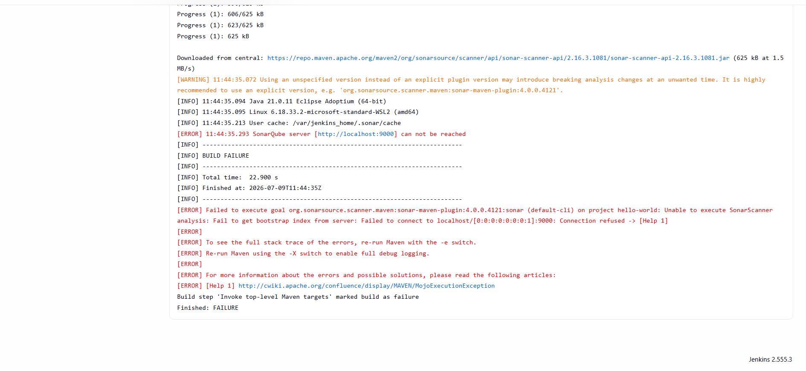
*Figure 9 — Sortie console : BUILD FAILURE, connexion refusée vers http://localhost:9000.*

### Solution : configuration de l'URL par nom de conteneur

Dans la configuration globale de Jenkins (SonarQube servers), l'URL du serveur a été corrigée en `http://sonarqube:9000` — le nom du conteneur sur le réseau Docker — et l'authentification est assurée par un token stocké dans les credentials Jenkins (Secret text), jamais en clair.

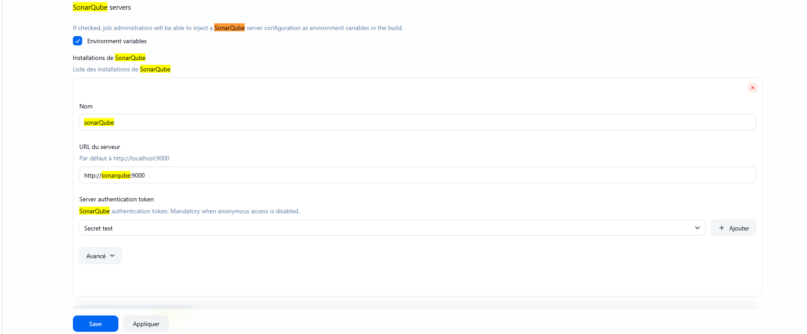
*Figure 10 — Configuration Jenkins « SonarQube servers » : URL http://sonarqube:9000 et token secret.*

### Résultats de l'analyse

Après correction, l'analyse aboutit : le projet `hello-world` apparaît dans SonarQube avec 140 lignes de code analysées, une couverture de 75,4 %, aucune vulnérabilité ni bug, et 3 points de maintenabilité.

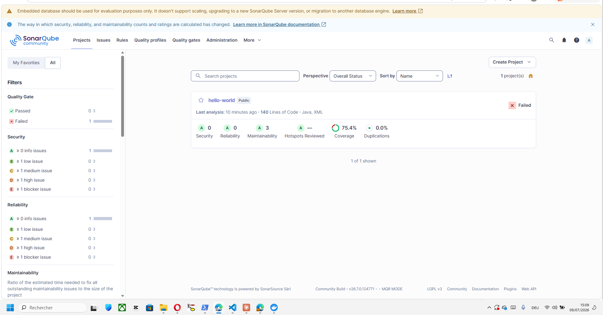
*Figure 11 — Tableau de bord SonarQube : projet hello-world analysé (couverture 75,4 %).*

Le quality gate est toutefois « Failed » sur le nouveau code : la couverture (79,0 %) reste sous le seuil exigé de 80 %, et 2 nouvelles issues dépassent le seuil autorisé. C'est exactement le rôle attendu d'un quality gate : bloquer la dégradation de la qualité.

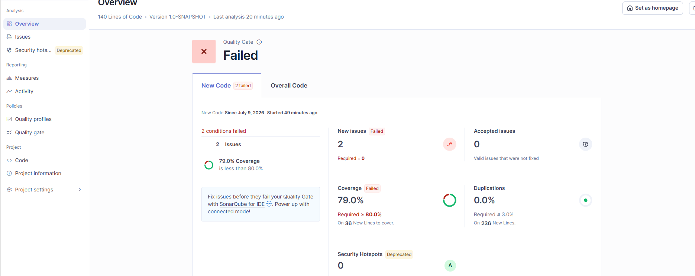
*Figure 12 — Détail du quality gate : 2 conditions non respectées sur le nouveau code.*

Les 3 issues remontées sont de même nature : « Replace this use of System.out by a logger » dans `App.java` — un rappel des bonnes pratiques de journalisation.

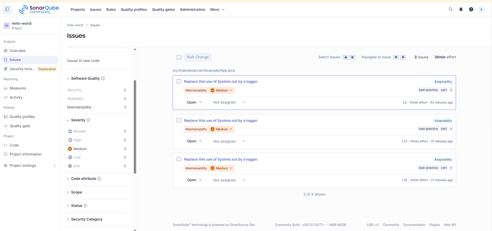
*Figure 13 — Issues de maintenabilité détectées : remplacer System.out par un logger.*

### Bilan

Ce TP illustre deux points clés : d'une part la subtilité des réseaux Docker (les conteneurs se joignent par leur nom, pas par `localhost`), d'autre part l'apport de SonarQube qui objective la qualité du code et impose des seuils mesurables à chaque build.

---

## TP 5 — Build paramétré

### Objectif

Rendre le job configurable à l'exécution grâce à des paramètres (environnement cible, version), et exploiter ces paramètres dans les étapes du build.

### Mise en œuvre

Le job HW-ci a été enrichi de paramètres `ENV` et `VERSION`. Lors du build #9, lancé avec `ENV=recette` et `VERSION=1.0.0`, le script de build affiche les valeurs reçues et compose dynamiquement le nom de l'artefact : `hello-world-1.0.0-recette.jar`. L'analyse SonarQube s'exécute dans la foulée et le build se termine en SUCCESS.


*Figure 14 — Console du build paramétré : ENV=recette, VERSION=1.0.0, artefact hello-world-1.0.0-recette.jar.*

### Bilan

Les builds paramétrés permettent de réutiliser un même job pour plusieurs environnements (dev, recette, production) et de tracer précisément ce qui a été construit, pour quelle cible et en quelle version.

---

## TP 6 — Déploiement automatique sur Tomcat

### Objectif

Déployer automatiquement l'application sur un serveur Tomcat après chaque build réussi, via le plugin « Deploy to container » : packaging WAR, action post-build de déploiement, et vérification dans le navigateur.

### Problèmes rencontrés

Le passage du packaging `jar` au packaging `war` a d'abord cassé l'archivage : le build #11 échoue car le motif `target/*.jar` ne correspond plus à rien (« No artifacts found that match the file pattern »). Le projet produit désormais un `.war`, la configuration d'archivage devait être mise à jour.

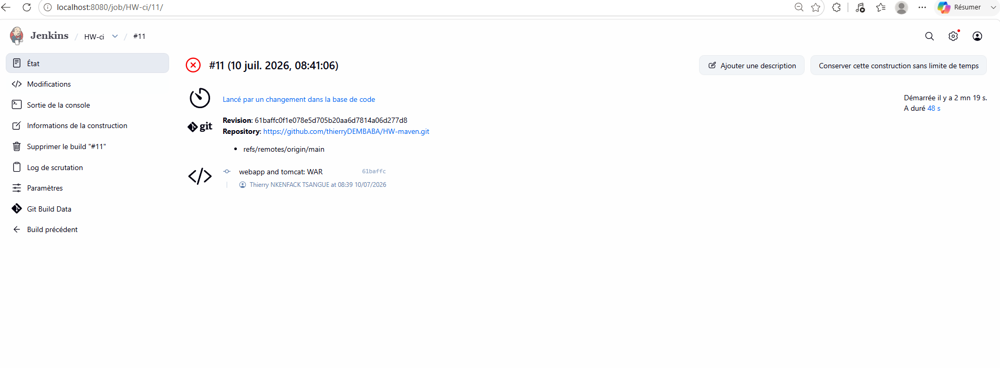
*Figure 15 — Build #11 (commit « webapp and tomcat: WAR ») en échec.*

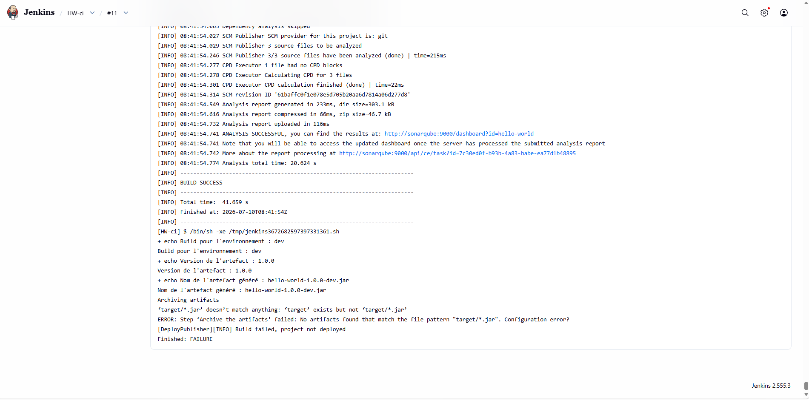
*Figure 16 — Console : l'archivage échoue car target/*.jar n'existe plus après le passage au WAR.*

Une seconde tentative échoue avec « No wars found. Deploy aborted » : l'étape de déploiement ne trouvait pas le WAR attendu.

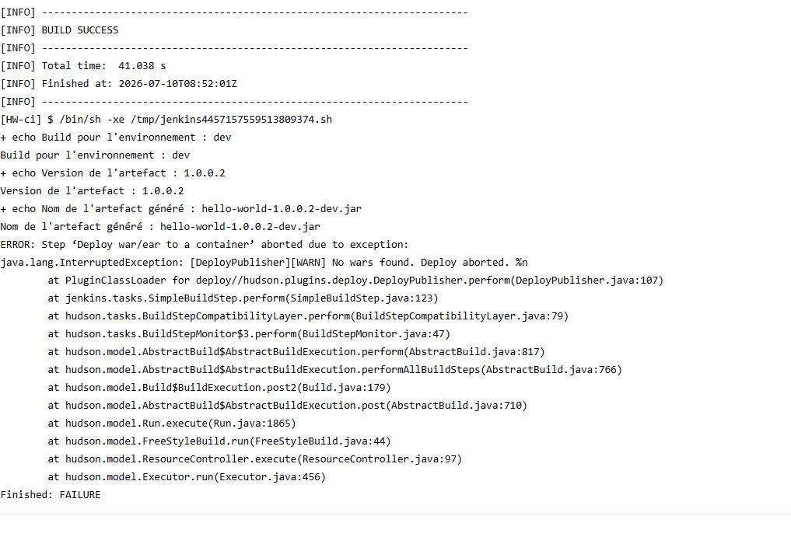
*Figure 17 — Console : « No wars found. Deploy aborted » lors de l'étape Deploy war/ear to a container.*

L'examen de la configuration a également révélé une URL Tomcat erronée : `http://tomcat:8000/manager` (port 8000 au lieu de 8080, port interne du conteneur). À noter que les identifiants du manager Tomcat sont bien référencés via les credentials Jenkins (`admin/******`), jamais en clair.

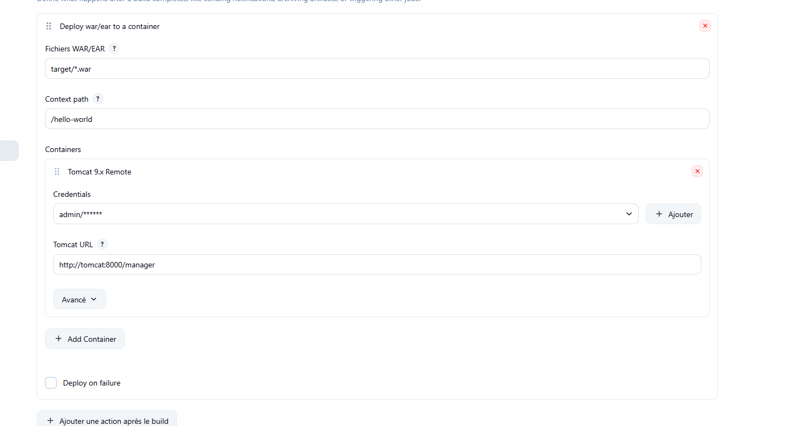
*Figure 18 — Action post-build « Deploy war/ear to a container » : URL Tomcat incorrecte (port 8000).*

### Résultat : application déployée

Après correction (motif `target/*.war`, URL `http://tomcat:8080/manager`), le déploiement aboutit. L'application est accessible sur `http://localhost:8081/hello-world` : la page affiche le module d'authentification (test réussi avec le bon mot de passe, échec avec un mauvais) et le module de calcul du périmètre d'un cercle (rayon 50 → périmètre 314,159…).

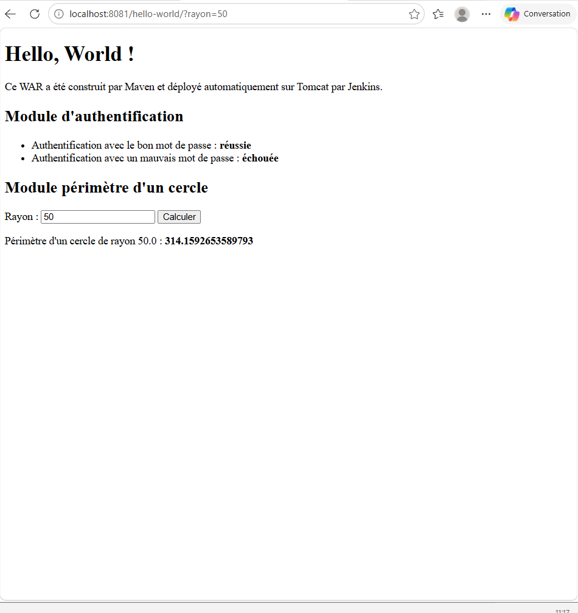
*Figure 19 — Application web déployée sur Tomcat : modules d'authentification et de calcul du périmètre opérationnels.*

### Bilan

La chaîne va désormais jusqu'au déploiement : chaque commit déclenche build, tests, analyse qualité puis mise en ligne sur Tomcat. Les échecs intermédiaires rappellent l'importance de la cohérence entre packaging, motifs d'archivage et configuration de déploiement — et qu'en cas d'échec de build, aucun déploiement n'a lieu.

---

## TP 7 — Pipeline Jenkins (pipeline as code)

### Objectif

Remplacer le job configuré à la souris par un pipeline décrit en code (Jenkinsfile) : étapes Checkout, Build, Test, Analyse, Déploiement définies dans un script Groovy versionné avec le projet.

### Problème rencontré : outil Maven introuvable

Le premier lancement échoue immédiatement : **« Tool type maven does not have an install of Maven-3.9 configured — did you mean maven? »**. Le Jenkinsfile référençait un outil nommé `Maven-3.9` alors que l'installation déclarée dans Global Tool Configuration s'appelle exactement `maven`.

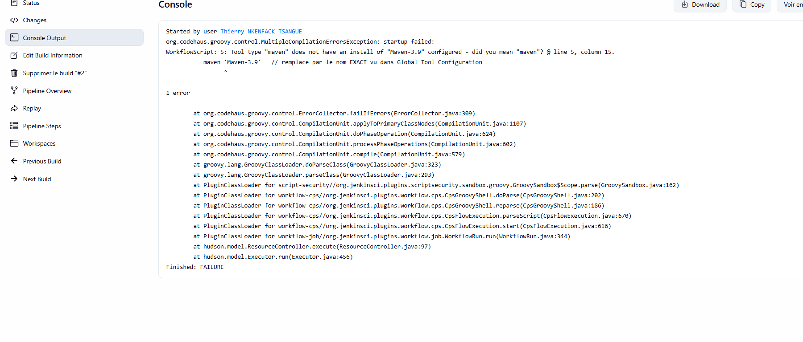
*Figure 20 — Échec du pipeline : le nom d'outil Maven du Jenkinsfile ne correspond pas à la configuration globale.*

### Correction et exécution

Le script a été corrigé (`tools { maven 'maven' }`) ; le pipeline clone le dépôt `HW-maven` depuis GitHub puis enchaîne les stages.

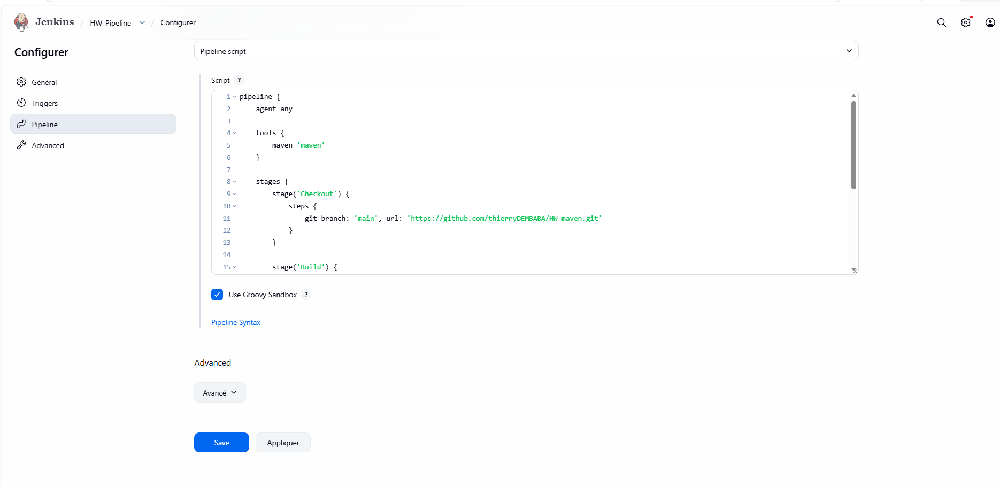
*Figure 21 — Configuration du pipeline : script Groovy avec agent, tools et stage Checkout.*

La vue « Stages » retrace l'apprentissage : build #1 échoué en cours de pipeline, #2 échoué au démarrage (erreur de script), puis #3 entièrement vert — les quatre étapes s'exécutent avec succès en 30 secondes.

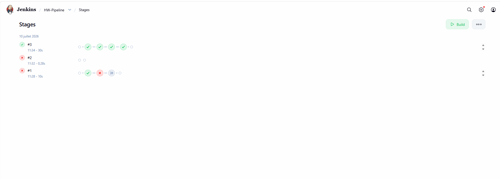
*Figure 22 — Vue Stages du job HW-Pipeline : après deux échecs, le build #3 passe toutes les étapes.*

### Bilan

Le pipeline as code apporte versionnage, revue et reproductibilité de la chaîne CI/CD. La configuration du build vit avec le code, dans le même dépôt Git.

---

## TP 8 — Agents Jenkins distribués

### Objectif

Déporter l'exécution des builds sur un agent distinct du contrôleur Jenkins (agent Linux connecté en SSH, conteneur Docker dédié), et observer le comportement de la file d'attente quand l'agent est indisponible.

### Observation : agent hors ligne, builds en attente

Les builds #9 et #10 du pipeline restent bloqués en file d'attente : la vue Stages affiche un sablier avec le message « En attente du prochain exécuteur disponible ».

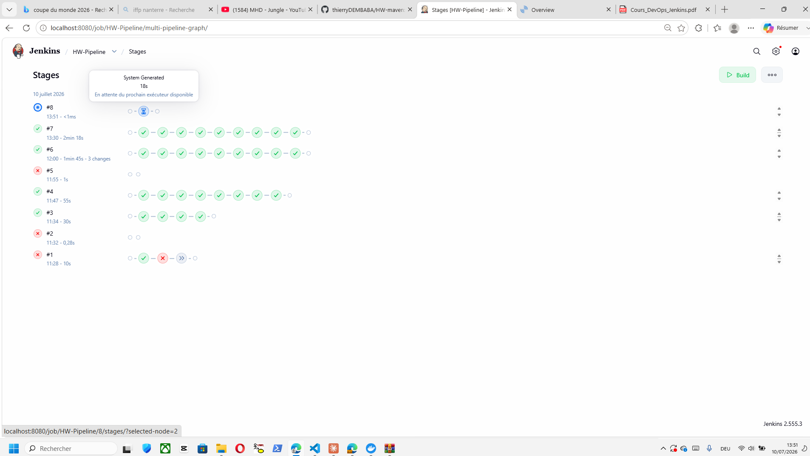
*Figure 23 — Builds #8 terminé et suivants en attente : aucun exécuteur disponible.*

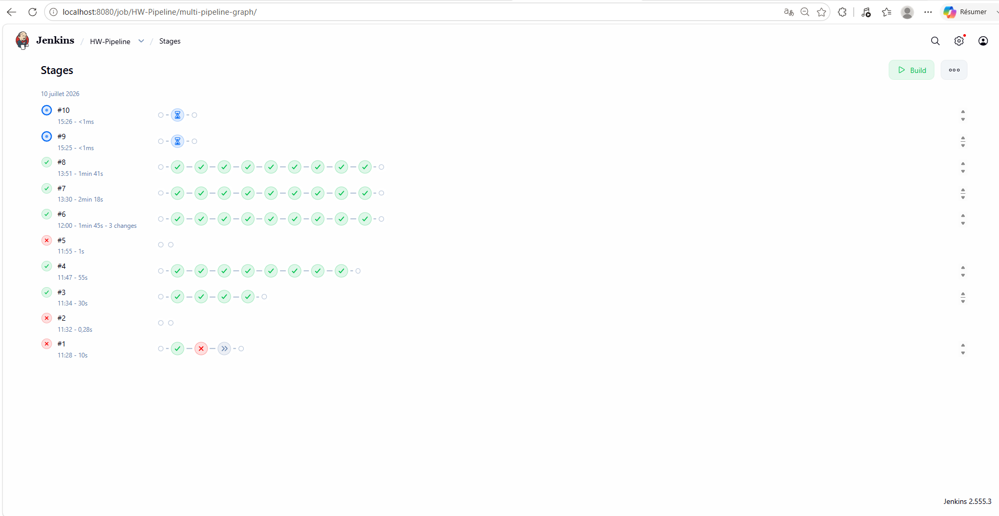
*Figure 24 — Builds #9 et #10 en file d'attente (sablier), en attente d'un agent.*

La console du build #9 est explicite : « 'agent-linux' is offline ». La cause est visible dans Docker Desktop : le conteneur `jenkins-agent` est arrêté.

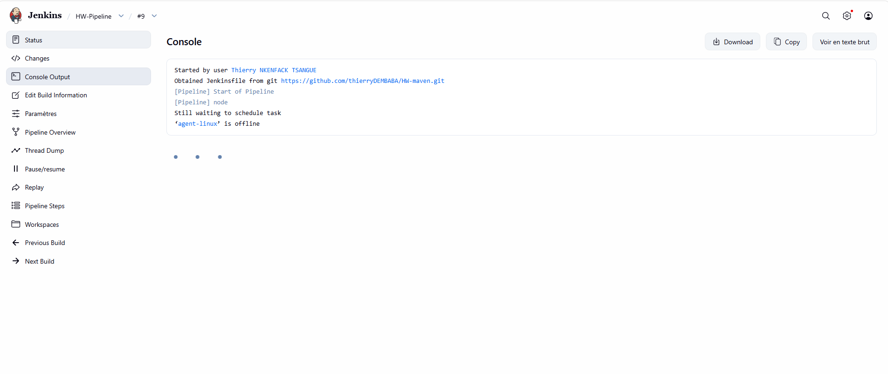
*Figure 25 — Console du build #9 : Still waiting to schedule task, l'agent agent-linux est hors ligne.*

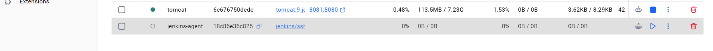
*Figure 26 — Docker Desktop : le conteneur jenkins-agent est à l'arrêt.*

### Résolution

Le redémarrage du conteneur (`docker start jenkins-agent`) reconnecte l'agent au contrôleur.

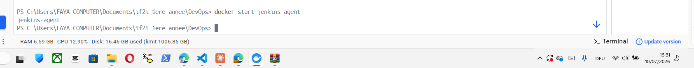
*Figure 27 — Redémarrage de l'agent depuis le terminal : docker start jenkins-agent.*

Dès que l'agent repasse en ligne, Jenkins dépile la file d'attente : le build #9 démarre et progresse dans ses stages, suivi du #10.

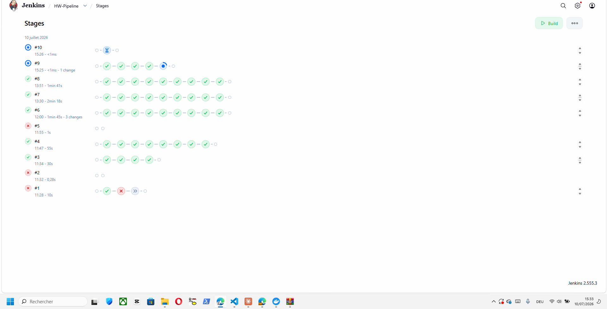
*Figure 28 — Agent de nouveau en ligne : les builds en attente démarrent immédiatement.*

### Bilan

L'architecture contrôleur/agents permet de répartir la charge et d'isoler les environnements de build. Jenkins gère proprement l'indisponibilité : les builds ne sont pas perdus mais mis en attente jusqu'au retour d'un exécuteur.

---

## TP 9 — Sauvegarde de Jenkins avec ThinBackup

### Objectif

Mettre en place une stratégie de sauvegarde automatique de la configuration Jenkins (jobs, historique, configuration globale) avec le plugin ThinBackup, et externaliser ces sauvegardes hors du conteneur.

### Mise en œuvre

ThinBackup est configuré pour écrire dans `/mnt/backups`, avec une sauvegarde complète planifiée chaque soir (`H 23 * * *`), l'attente de l'inactivité de Jenkins avant sauvegarde (quiet mode, 120 min max) et l'inclusion des résultats de builds.

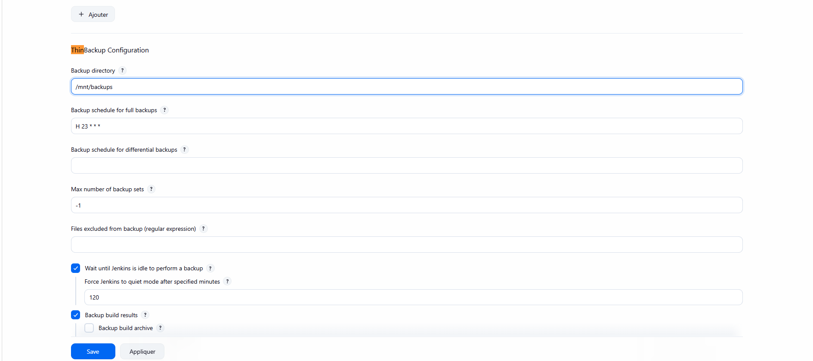
*Figure 29 — Configuration ThinBackup : répertoire /mnt/backups et planification quotidienne.*

Pour que les sauvegardes survivent au conteneur, celui-ci a été recréé avec un montage supplémentaire : le dossier Windows `jenkins-backups` du PC hôte est lié à `/mnt/backups` dans le conteneur :

```bash
docker stop funny_edison
docker run -d --name jenkins-v2 --network devops-network -p 8080:8080 \
  -v jenkins_home:/var/jenkins_home \
  -v "C:\...\jenkins-backups:/mnt/backups" \
  jenkins/jenkins:lts
```

On vérifie dans le conteneur la présence du dossier `FULL-2026-07-10_22-02`.

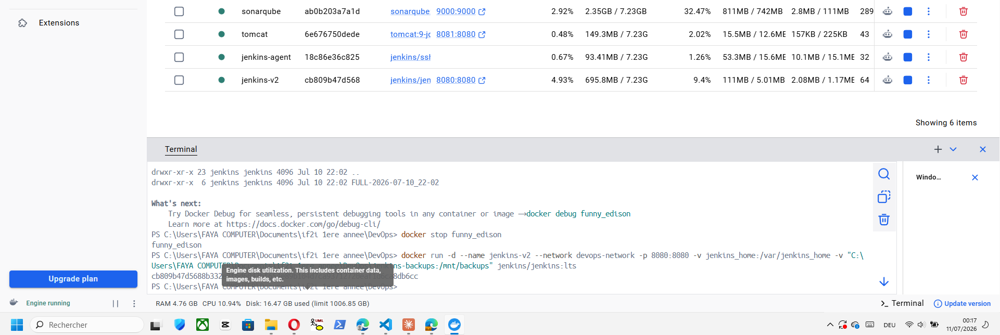
*Figure 30 — Recréation du conteneur Jenkins avec bind mount du dossier de sauvegardes vers le PC hôte.*

Résultat : la sauvegarde complète (`FULL-2026-07-10_22-18`) apparaît directement dans l'explorateur Windows, hors du conteneur. En cas de perte du conteneur ou du volume, la configuration Jenkins est restaurable.

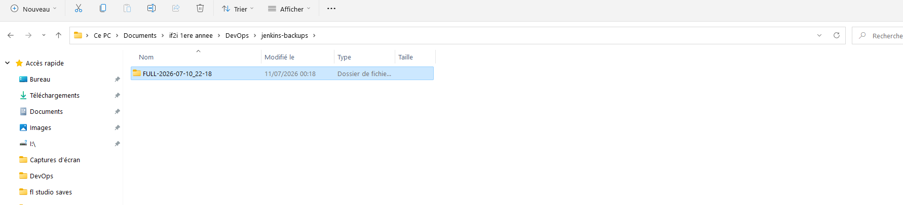
*Figure 31 — Sauvegarde complète visible dans l'explorateur Windows : externalisation réussie.*

### Bilan

La sauvegarde clôt la chaîne DevOps : l'outil d'intégration lui-même est résilient. La combinaison ThinBackup + bind mount Docker garantit des sauvegardes automatiques, datées et stockées hors de l'infrastructure conteneurisée.

---

## Conclusion

Au terme de ces neuf travaux pratiques, une chaîne CI/CD complète et opérationnelle a été construite : du simple build manuel (TP1) jusqu'à un pipeline as code exécuté sur un agent distribué (TP7-TP8), en passant par l'automatisation des builds à chaque commit (TP3), le contrôle qualité avec SonarQube et JaCoCo (TP4), les builds paramétrés (TP5), le déploiement continu sur Tomcat (TP6) et la sauvegarde de l'infrastructure (TP9).

Les difficultés rencontrées ont été aussi formatrices que les succès : résolution de noms entre conteneurs Docker (`localhost` vs nom de conteneur), cohérence entre packaging Maven et configuration Jenkins, correspondance exacte des noms d'outils dans les Jenkinsfile, ou encore gestion des agents hors ligne. Chacune a été diagnostiquée à partir des logs de build, corrigée, puis validée par un nouveau build — c'est précisément la boucle de rétroaction rapide que promeut la démarche DevOps.

Les acquis de ces TP — automatisation, mesure de la qualité, infrastructure conteneurisée, pipeline as code et résilience — constituent le socle des pratiques d'ingénierie logicielle moderne et pourront être directement réinvestis dans des projets d'entreprise.
